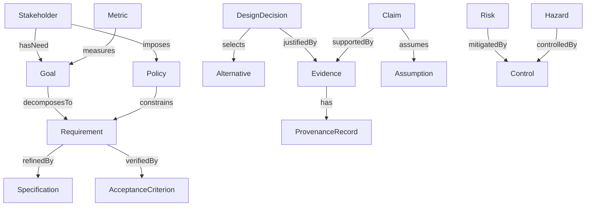
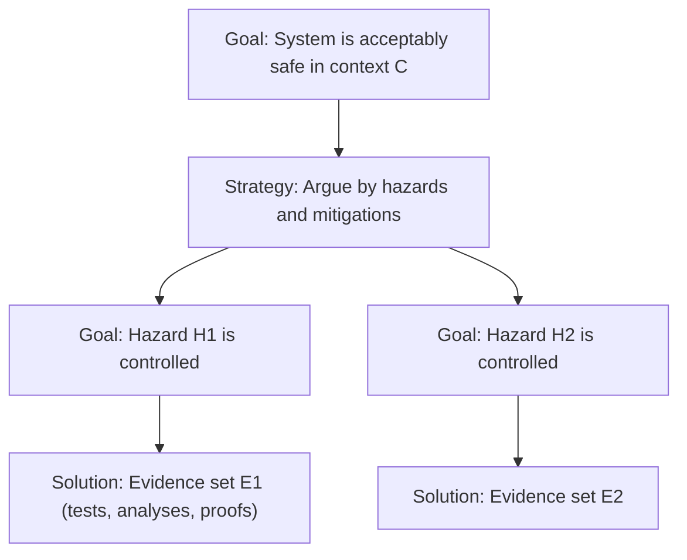
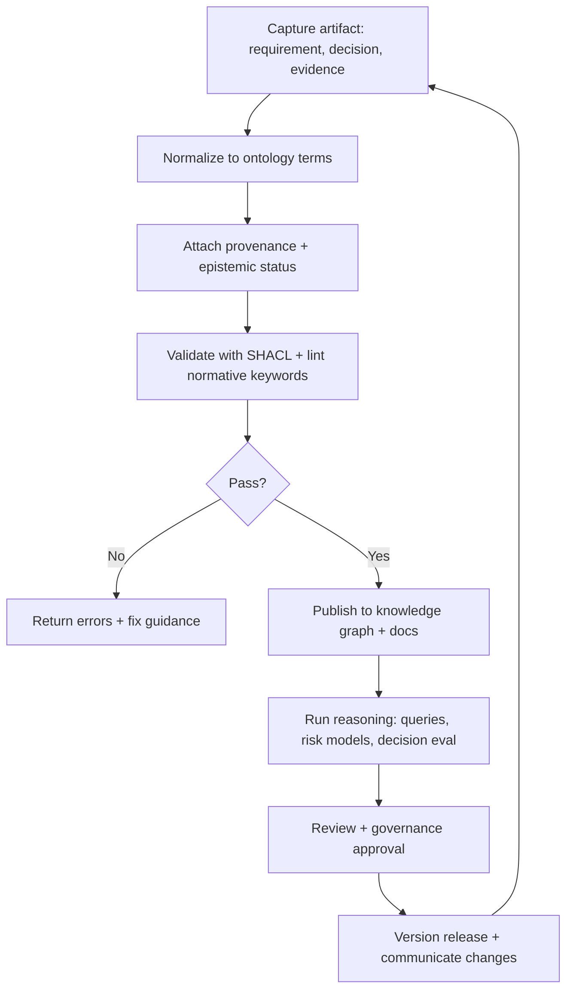

# Building a Logic–Philosophy Corpus for Product Knowledge

## Executive summary

A full technical “logic–philosophy corpus of product knowledge” is a **versioned, machine-checkable body of product knowledge** that (a) defines a shared **ontology/taxonomy** of product concepts, (b) encodes **normative and epistemic commitments** (what *must/should/may* be true; what is *known/assumed/uncertain*), and (c) supports **formal reasoning** across requirements, decisions, risks, and evidence—while still remaining usable by product teams day to day. The practical foundation is to represent knowledge as a graph (triples) and validate it with constraints, using standards-based web semantics: RDF for the data model, OWL for formal meaning, SKOS for controlled vocabularies/taxonomies, SHACL for validation, JSON-LD for integration with typical JSON systems, and PROV-O for provenance. citeturn1search0turn1search1turn10search2turn10search3turn1search6turn1search3

The corpus should be structured as layered “modules,” each with clear semantics and governance: (1) a **core ontology** for product knowledge, (2) a **logic layer** (multiple logics, chosen per task), (3) a **specification/template library** for requirements, stories, acceptance criteria, trade-offs, uncertainty/risk, and governance, (4) scenario “worked examples,” and (5) an **operational toolchain** (schema registry, API, validation pipeline, and change control). Requirements engineering and documentation standards provide an anchor for content expectations and life-cycle artifacts (ISO/IEC/IEEE 29148 for requirements engineering; ISO/IEC/IEEE 15288 and 12207 for life-cycle processes; ISO/IEC/IEEE 15289 for documentation information items). citeturn0search5turn0search1turn4search0turn4search1turn11search0

To make this corpus *analytically rigorous*, it must explicitly separate:
- **Deontic/normative statements** (obligations, permissions, prohibitions) from **descriptive statements** (observations, forecasts, measurements). Deontic logic originates as a formal treatment of obligation/permission/prohibition, and is a natural foundation for compliance, policy, and governance rules. citeturn12search1turn12search13  
- **Epistemic status**: what the organization treats as knowledge vs. justified belief vs. assumption vs. open question. The “Gettier problem” illustrates why “justified true belief” can fail to be knowledge, motivating explicit representation of justification and defeaters in product evidence. citeturn9search0turn9search16  
- **Uncertainty and causality**: probability as axiomatized measure (Kolmogorov), Bayesian updating (Bayes), Bayesian networks for structured uncertainty (Pearl), and causal reasoning distinguishing observation from intervention (Pearl’s causality framework). citeturn8search13turn8search0turn12search3turn8search3turn13search2

Finally, the corpus must be tested like any engineering artifact: validated via SHACL/OWL reasoning, measured for coverage and usefulness, and governed with provenance + versioning so “why we believe this” is queryable and auditable. citeturn10search3turn1search3turn0search3

## Scope, objectives, and design principles

**Scope.** “Product knowledge” in this corpus is not only “what the product does,” but the *entire justified body of claims* that supports product decisions and documentation across the life cycle: stakeholder needs, requirements, designs, decisions, evidence, risks, quality attributes, compliance obligations, and operational learnings. This aligns with systems/software life-cycle thinking and requirements engineering process/product guidance. citeturn4search0turn4search1turn0search5

**Primary objectives.**
1. **Formalize shared meaning**: create a common vocabulary (ontology/taxonomy) so teams interpret “requirement,” “assumption,” “risk,” “acceptance criterion,” and “evidence” consistently. A standard definition of an ontology as a specification of vocabulary (classes/relations/functions) is widely used in knowledge engineering. citeturn10search0turn10search4  
2. **Enable traceable reasoning**: every important product claim (e.g., “feature X improves retention,” “system is safe enough,” “data processing is permitted”) should trace to evidence and assumptions with provenance. PROV-O is designed to represent and interchange provenance information across systems. citeturn1search3turn1search27  
3. **Improve decision quality under uncertainty**: encode probabilistic beliefs, causal hypotheses, and trade-off models so decisions are explainable and revisable. Probability’s axiomatization and Bayesian inference are canonical foundations, and Bayesian networks are a standard representation for probabilistic knowledge. citeturn8search13turn8search0turn12search3  
4. **Make documentation executable/validatable**: requirements and acceptance criteria become machine-checkable with constraint languages and normative keywords (MUST/SHOULD/MAY), reducing ambiguity and drift. RFC 2119 defines requirement-level keywords and RFC 8174 clarifies that only uppercase forms carry the defined normative meaning. citeturn0search2turn13search3  
5. **Support governance and assurance**: for high-stakes products, represent structured assurance cases linking claims to evidence and assumptions (ISO/IEC 15026-2) and use safety standards where required (e.g., IEC 61508; DO-178C referenced by FAA guidance; ISO 26262 for automotive functional safety). citeturn14search2turn3search28turn3search6turn3search30turn3search1

**Design principles.**
- **Layered formality (“right logic for the job”)**: not everything should be forced into one formalism. Use SHACL for structural constraints, OWL for taxonomy/semantics, deontic logic for obligations, Bayesian nets for uncertainty, temporal logic/model checking for behaviors. citeturn10search3turn1search1turn12search3turn6search0  
- **Explicit epistemic labeling**: every claim is tagged as *observed*, *modeled*, *assumed*, *normative*, *counterfactual*, etc. This is an operational response to classic epistemic concerns about justification and knowledge. citeturn9search0turn9search16  
- **Separation of normative vs descriptive**: policy/obligation statements are represented distinctly from empirical claims; they interact via compliance checks, not conflation. Deontic logic’s purpose is precisely to formalize obligation/permission/prohibition. citeturn12search1turn12search13  
- **Provenance-first**: every imported dataset, experiment, and external report receives provenance metadata to support trust calibration and audits. citeturn1search3  
- **Versioned, governed evolution**: treat the corpus as a product with releases, migrations, and backward compatibility policies; documentation standards explicitly treat “information items” as managed life-cycle artifacts. citeturn11search0turn11search4

## Target audiences and use cases

**Product managers.** Use the corpus to maintain a coherent chain from problem framing → hypotheses → requirements → success metrics → decisions and rationale. Requirements engineering standards emphasize defining requirements content and characteristics across life cycle. citeturn0search5turn0search1

**Engineers and architects.** Use formal specs (temporal logic/model checking; structural constraint checking) to prove properties (safety, liveness, invariants) or find counterexamples early. Temporal logic for programs and formal specification languages such as TLA+ are canonical foundations for such verification approaches. citeturn6search0turn6search1turn6search29

**Designers and researchers.** Use epistemic structure to maintain “what is known” from research vs “what is believed,” and connect qualitative and quantitative evidence to decisions; structured provenance helps teams interpret evidence reliability. citeturn1search3turn9search0

**Legal/compliance, security, and risk owners.** Use deontic constraints (“must,” “must not”), plus risk frameworks, to encode obligations and produce auditable compliance evidence. Risk management guidelines are standardized (e.g., ISO 31000; NIST risk assessment guidance). citeturn2search2turn2search7turn12search1turn13search3

**Safety/assurance engineers (safety-critical domains).** Use assurance cases connecting claims to evidence and assumptions (ISO/IEC 15026-2), plus domain safety standards and structured argument notations (e.g., GSN community standard). citeturn14search2turn14search13

**Representative use cases.**
- **Ambiguity reduction in specs**: enforce normative keyword conventions (RFC 2119/8174) and validate requirement templates with SHACL. citeturn0search2turn13search3turn10search3  
- **Decision traceability**: maintain “decision records” that cite evidence, alternatives, assumptions, and trade-offs, with provenance and versioning. citeturn1search3turn11search0  
- **Uncertainty-aware roadmaps**: represent probabilities and causal hypotheses about outcomes rather than “certainty theater,” grounded in formal probability and Bayesian methods. citeturn8search13turn8search0  
- **Integration of predictive/simulation evidence**: modern products increasingly rely on simulation/agent-based prediction for decisions; for example, entity["company","Aaru","ai prediction startup"] describes itself as simulating populations to connect predicted behavior to decisions, illustrating a class of evidence sources a corpus can capture (as “model output” with provenance + assumptions). citeturn0search0turn0search8turn0news40

## Ontology and taxonomy of concepts

### Knowledge representation choices

A corpus that wants both human usability and machine rigor benefits from separating:
- **Vocabulary/taxonomy** (concept schemes, labels, hierarchies): SKOS provides a “common data model for sharing and linking knowledge organization systems” such as taxonomies and thesauri. citeturn10search2  
- **Formal semantics** (classes/properties with logical meaning): OWL provides a formally defined ontology language “roadmap” used with RDF. citeturn1search1turn1search0  
- **Validation constraints** (what data must look like): SHACL defines constraints for validating RDF graphs. citeturn10search3turn0search3  
- **Interoperable serialization**: JSON-LD provides a JSON-based linked data format for interoperable web services and storage engines. citeturn1search6turn1search2  
- **Provenance**: PROV-O provides classes/properties to represent provenance information and can be specialized. citeturn1search3  
Underlying all of this is RDF’s triple-based graph model (subject–predicate–object). citeturn1search0

### Core taxonomy table

The table below is a **reference taxonomy** (classes plus high-value relations). It is intended to be implementable in OWL (types/relations) with SKOS concept schemes (controlled vocab labels) and SHACL shapes (validation rules). citeturn1search1turn10search2turn10search3

| Class (top-level) | Definition (operational) | Key relations (examples) | Typical instances |
|---|---|---|---|
| Stakeholder | Any party affected by or influencing the product | `hasNeed`, `hasConstraint`, `imposesObligation` | customer segment, regulator, internal ops |
| Goal | Desired outcome state (business/user/safety) | `decomposesTo`, `measuredBy` | “reduce churn,” “avoid hazardous overdose” |
| Claim | Asserted proposition about product/world | `supportedBy`, `defeatedBy`, `hasStatus` | “feature A increases retention” |
| Assumption | Provisional premise treated as true for reasoning | `assumptionFor`, `invalidatedBy` | “users enable notifications” |
| Evidence | Artifact supporting/refuting a claim | `evidenceFor`, `derivedFrom`, `hasProvenance` | experiment result, interview summary |
| Requirement | Constraint on system/product behavior or quality | `satisfiesGoal`, `verifiedBy`, `conflictsWith` | functional; quality; regulatory |
| Specification | Formal/semi-formal description implementing requirements | `implements`, `constrains`, `refines` | API spec, state machine, model |
| DesignDecision | Chosen alternative with rationale | `selectsAlternative`, `justifiedBy`, `hasTradeoff` | “use OAuth,” “batch processing” |
| Alternative | Candidate option for a decision | `comparedAgainst`, `hasCost`, `hasRisk` | “GraphQL vs REST” |
| Risk | Uncertain event with negative impact | `hasLikelihood`, `hasImpact`, `mitigatedBy` | data breach risk, safety hazard |
| Hazard | Source of potential harm (safety-critical) | `leadsTo`, `controlledBy` | “overheating,” “over-infusion” |
| Control/Mitigation | Measure reducing likelihood/impact | `mitigatesRisk`, `verifiesControl` | rate limiter, redundancy |
| Metric | Quantitative measure with definition | `measuresGoal`, `computedFrom` | retention, latency p95 |
| Policy/Obligation | Normative constraint (must/shall/forbidden) | `obligates`, `permits`, `prohibits` | privacy rule, access policy |
| GovernanceArtifact | Managed record ensuring accountability | `approvedBy`, `versionOf`, `supersedes` | decision record, audit log |
| ProvenanceRecord | “Who/what/when/how produced this” | `wasGeneratedBy`, `wasAttributedTo` | PROV activity/entity/agent |

### Ontology diagram



### Visual reference examples

image_group{"layout":"carousel","aspect_ratio":"16:9","query":["product knowledge graph ontology diagram","SHACL shapes constraint language diagram","Bayesian network example diagram","assurance case GSN diagram"],"num_per_query":1}

## Formal logical frameworks and notations for product reasoning

A corpus is strongest when it treats “logic” as a **toolbox**, not a monolith. Below are the major formalisms requested and their product-knowledge role, with primary-source anchors.

### Comparative table of logical frameworks

| Framework | Core notion | Best product use | Typical representation | Key strengths | Key pitfalls |
|---|---|---|---|---|---|
| Propositional logic | truth of atomic propositions with connectives | simple gating rules; consistency checks | formulas over booleans | simple, automatable | limited expressiveness |
| First-order predicate logic | quantified statements about objects/relations | formalizing requirements over entities (“for all users…”) | predicates + ∀/∃ | expressive and precise | can be hard to keep usable |
| Modal logic | necessity/possibility across possible worlds | “must/can” semantics; capability vs guarantee | □P, ◇P; Kripke frames | formal access to “necessity” | ambiguity if “worlds” unclear citeturn7search0turn12search2 |
| Deontic logic | obligation/permission/prohibition | policy & compliance; authorization; governance rules | O(P), P(P), F(P) | matches normative language | paradoxes; needs careful modeling citeturn12search1turn12search13 |
| Probabilistic logic / probability theory | measures over events | uncertainty in outcomes; reliability modeling | P(A), distributions | principled uncertainty | requires calibration & data citeturn8search13turn8search5 |
| Bayesian inference | updating beliefs with evidence | experiment interpretation; diagnosis; forecasting | posterior ∝ prior×likelihood | explicit learning from data | priors and model misspecification citeturn8search0 |
| Bayesian networks | graphical factorization of probability | risk models, funnel conversion, failure diagnosis | DAG with CPTs | interpretable structure | assumes conditional independencies citeturn12search3turn12search11 |
| Causal models | effect of interventions vs observations | “what if we change X?” product causality | SCM; do(·) calculus | distinguishes correlation/causation | needs causal assumptions citeturn8search3turn13search2 |
| Decision theory (subjective expected utility) | rational choice under uncertainty | trade-offs; roadmap bets; portfolio selection | maximize E[U] | coherent preferences and choice | human values & utilities hard to elicit citeturn13search29turn8search2 |
| Temporal logic / model checking | reasoning over time/behaviors | concurrency, protocols, liveness/safety properties | LTL/CTL; invariants | finds counterexamples early | modeling overhead citeturn6search0 |
| Formal specification (TLA+) | set theory + first-order + temporal actions | protocol/system specs; invariants & refinement | TLA+ modules/specs | executable checking mindset | requires discipline & training citeturn6search1turn6search29 |
| Alloy (relational modeling + SAT) | bounded model finding | data model constraints; invariants | signatures/relations | fast counterexamples | bounded scope may miss issues citeturn6search6turn6search2 |

### Normative notation for requirements

Because product documentation often mixes descriptive and normative language, the corpus should standardize normative strength using RFC-style keywords: RFC 2119 defines the intended meanings and RFC 8174 clarifies capitalization rules, enabling automatic parsing/validation of “MUST/SHOULD/MAY” requirements in specs. citeturn0search2turn13search3

### Where the semantic-web stack fits

The above logics answer “how do we reason?”, while the semantic-web standards answer “how do we represent and validate what we know?”:
- RDF graphs (triples) are the shared substrate. citeturn1search0  
- OWL encodes class/property semantics (e.g., disjointness, subclassing). citeturn1search1  
- SHACL validates instance data against shapes (“every Requirement must have an owner, priority, verification method”). citeturn10search3turn0search3  
- SKOS layers controlled vocabularies for categories like “risk type,” “requirement type,” “evidence type.” citeturn10search2  
- PROV-O captures provenance for evidence and claims. citeturn1search3  
- JSON-LD enables integration with typical JSON-first systems. citeturn1search6

## Philosophical foundations mapped to product practice

This section provides the “philosophy → product practice” map, focusing on epistemology, ontology, ethics, and philosophy of science, and showing how each becomes corpus content and constraints.

### Mapping table: philosophy to product operations

| Philosophical area | Core question | Operational product interpretation | Corpus encoding pattern | Primary anchors |
|---|---|---|---|---|
| Epistemology | What counts as knowledge/justification? | Separate *belief*, *evidence*, *assumption*, *defeater*; require “why we believe this” links | Claim–Evidence–Assumption graph; provenance; confidence; defeaters | entity["people","Edmund Gettier","philosopher epistemology"] on weaknesses of “JTB,” motivating explicit justification tracking citeturn9search0turn9search16 |
| Ontology | What entities exist in the domain? | Define stable concept types (Requirement, Decision, Metric) and relations; avoid category errors | OWL class/property model + SKOS concept schemes | “Ontology as shared vocabulary specification” in entity["people","Thomas R. Gruber","computer scientist ontology"] citeturn10search0turn10search4 |
| Ethics | What ought we do? What harms are acceptable? | Encode obligations (privacy, fairness, consent), and record ethical trade-offs | Deontic rules; risk/impact assessments; governance artifacts | entity["organization","Association for Computing Machinery","professional society"] Code emphasizes public good and ethical responsibility citeturn5search0; entity["organization","U.S. Department of Health and Human Services","federal agency"] Belmont principles for human-subject research ethics citeturn5search2turn5search6 |
| Philosophy of science | How do we test/learn? What is evidence? | Treat roadmap bets as hypotheses; require falsifiability criteria; manage paradigm shifts | Experiment objects; hypothesis registry; Bayesian updates; change logs | entity["people","Karl Popper","philosopher of science"] on falsifiability/demarcation citeturn9search1turn9search9; entity["people","Thomas S. Kuhn","philosopher of science"] on paradigms/normal science shifts citeturn9search2turn9search10; entity["people","Imre Lakatos","philosopher of science"] on research programmes/progressive vs degenerating shifts citeturn9search3turn9search15 |

### Ethics and AI risk as corpus modules

For products involving AI (or significant automated decisioning), map ethics into explicit risk controls and governance checks. The entity["organization","National Institute of Standards and Technology","us standards agency"] AI Risk Management Framework is explicitly designed as a practical resource to manage AI risks and is expected to evolve over time—making it a natural “external standard reference module” for the corpus. citeturn5search3turn5search19

Similarly, ISO 31000 provides general principles/guidelines for risk management across identifying, analyzing, treating, monitoring, and communicating risks—useful as the general risk module. citeturn2search2turn2search6

## Templates, formal specifications, and worked examples

This section provides (a) reusable templates/formal specs and (b) three scenario worked formalizations: consumer app, enterprise SaaS, and safety-critical system.

### Template set for the corpus

#### Requirement (machine-checkable record)

```yaml
id: REQ-<unique>
type: functional | quality | regulatory | constraint
statement: "The system MUST ..."
normative_basis:
  keywords_standard: "RFC2119/8174"
rationale:
  goal_links: [GOAL-...]
  stakeholder_links: [STK-...]
verification:
  method: test | analysis | inspection | demonstration
  acceptance_criteria_ids: [AC-...]
traceability:
  derived_from: [NEED-..., POLICY-...]
  refined_by: [SPEC-..., DESIGN-...]
quality_attributes:
  - name: <e.g., reliability, security>
    reference_model: "ISO/IEC 25010"
risk_links: [RISK-...]
status: proposed | approved | deprecated
version: <semver>
provenance:
  created_by: <agent>
  created_at: <timestamp>
```

Why these fields: ISO/IEC/IEEE 29148 emphasizes requirements engineering processes/products and characteristics of “good requirements,” while RFC 2119/8174 provides normative keyword semantics; ISO/IEC 25010 provides a quality characteristic model usable as a reference taxonomy for quality requirements. citeturn0search5turn0search1turn0search2turn13search3turn11search3turn11search34

#### User story (human-friendly, ontology-linked)

```yaml
id: US-<unique>
role: <persona or stakeholder role>
capability: <what they can do>
value: <why it matters>
linked_goals: [GOAL-...]
linked_requirements: [REQ-...]
assumptions: [ASM-...]
evidence: [EVD-...]   # research that motivates it
```

#### Acceptance criteria (executable specification style)

Use Gherkin when you want a bridge from product criteria to automated tests.

```gherkin
Feature: <feature name>
  Scenario: <scenario name>
    Given <context>
    When <action>
    Then <expected outcome>
```

The Gherkin grammar is documented in Cucumber’s reference, including structural keywords like `Feature` and scenario organization. citeturn4search3turn4search7

#### Risk and uncertainty model (probability + impact)

```yaml
id: RISK-<unique>
event: <undesired event>
context: <system boundary>
likelihood:
  model: qualitative | quantitative
  value: <e.g., 0.02 per month>
impact:
  dimensions: [safety, financial, legal, user_trust]
  severity: <scale or quantified>
risk_response:
  strategy: avoid | mitigate | transfer | accept
  controls: [CTRL-...]
evidence_and_provenance:
  inputs: [EVD-..., DATASET-...]
  method_notes: <assumptions, model form>
monitoring:
  indicators: [MET-...]
  review_interval: <period>
```

This is aligned with the general process framing of ISO 31000 (identify/analyze/evaluate/treat/monitor) and with NIST SP 800-30’s focus on systematic risk assessment guidance. citeturn2search2turn2search7turn2search3

#### Trade-off analysis (decision-theoretic)

```yaml
id: DEC-<unique>
decision_question: <what choice?>
alternatives:
  - id: ALT-A
  - id: ALT-B
criteria:
  - name: <criterion>
    weight: <0..1>
    utility_function: <definition>
uncertainty_model:
  type: bayesian_net | scenario_tree | monte_carlo
  artifact: <link/model id>
decision_rule: "maximize expected utility"
rationale_links:
  evidence: [EVD-...]
  assumptions: [ASM-...]
  risks: [RISK-...]
approval:
  owner: <role>
  date: <timestamp>
```

This is grounded in subjective expected utility traditions (von Neumann–Morgenstern utility axioms; Savage’s foundations for personal probability/decision under uncertainty). citeturn13search29turn8search2

#### Governance record (assurance-ready)

For high assurance, represent structured arguments linking claims to evidence and assumptions.

```yaml
id: ASR-<unique>
top_claim: "System/property X holds in context C"
argument_structure: gsn | structured_text
subclaims: [CLM-...]
evidence: [EVD-...]
assumptions: [ASM-...]
confidence_notes: <known gaps, limitations>
status: draft | reviewed | accepted
```

ISO/IEC 15026-2 defines assurance cases as claims + argumentation + evidence + explicit assumptions. citeturn14search2turn14search14

### Worked scenario consumer app

**Scenario.** A consumer mobile app introduces “smart reminders” to improve weekly retention while minimizing annoyance and respecting user preferences.

**Ontology instantiation (selected).**

```json
{
  "Goal": {"id":"GOAL-RET-01","text":"Increase 7-day retention by 3% without increasing opt-out rate"},
  "Requirement": {"id":"REQ-NOTIF-01","statement":"The app MUST allow disabling reminders at any time"},
  "Metric": [{"id":"MET-RET-7D","name":"7-day retention"},{"id":"MET-OPTOUT","name":"reminder opt-out rate"}],
  "Risk": {"id":"RISK-UX-01","event":"Reminders increase user annoyance and churn"},
  "Decision": {"id":"DEC-REM-01","question":"Enable smart reminders by default?","alts":["ALT-ON","ALT-OFF"]}
}
```

**Formalization highlights.**
- **Deontic layer (policy-like):**  
  O(user_can_disable_reminders_anytime)  
  This expresses an obligation aligned with user autonomy and consent-style norms; deontic logic formalizes obligation/permission/prohibition. citeturn12search1turn12search13  
- **Probabilistic layer (uncertainty):** represent belief about “smart reminders improve retention” as a hypothesis with priors, updated via A/B tests. Bayesian reasoning originates in Bayes’ work and is grounded in modern probability axioms formalized by Kolmogorov. citeturn8search0turn8search13  
- **Validation layer:** SHACL constraints ensure every reminder-related requirement has an opt-out path and acceptance tests; SHACL is explicitly defined as a language for validating RDF graphs against conditions. citeturn0search3turn10search3

**Acceptance criteria (Gherkin).**

```gherkin
Feature: Reminder controls
  Scenario: User disables reminders
    Given reminders are enabled
    When the user toggles reminders off
    Then the app stops sending reminders within 5 minutes
```

Cucumber documents `Feature` structure and keyword usage in its reference. citeturn4search3

### Worked scenario enterprise SaaS

**Scenario.** Enterprise SaaS introduces a new “audit export API” to satisfy compliance teams (e.g., data access logs) while meeting SLA performance and authorization constraints.

**Key corpus moves.**
- **Requirements as normative specs**: use RFC 2119/8174 keywords consistently for API requirements (“The API MUST return…”). citeturn0search2turn13search3  
- **Quality requirements**: categorize nonfunctional requirements using ISO/IEC 25010 quality characteristics (e.g., security, reliability, performance efficiency). citeturn11search3turn11search34  
- **API as a formal artifact**: define the API using OpenAPI, described as a language-agnostic interface description for HTTP APIs enabling humans and computers to understand service capabilities. citeturn2search0turn2search32  
- **Life-cycle documentation**: treat “audit export spec,” “threat model,” and “test plan” as managed information items as per documentation guidance standards. citeturn11search0turn11search4

**A minimal deontic + predicate formalization.**
- Let `Authorized(u, tenant, scope)` be a predicate.  
- Requirement (authorization):  
  ∀u,tenant. Request(u,tenant) → (Authorized(u,tenant,"audit:read") ⇒ Permit(Export(u,tenant)))  
  and (¬Authorized(u,tenant,"audit:read") ⇒ Forbid(Export(u,tenant))))

The deontic foundation is formally treated in von Wright’s work; the practical surface form is enforced using normative keywords and automated policy tests. citeturn12search1turn0search2

### Worked scenario safety-critical system

**Scenario.** A safety-critical controller (e.g., an automated dosing controller or industrial safety function) must satisfy functional safety and produce evidence that the system is acceptably safe for specified contexts.

**Standards anchoring (why they matter in the corpus).**
- IEC 61508 provides a cross-sector functional safety framework emphasizing risk-based determination of required safety function performance across the safety lifecycle. citeturn14search3turn3search28  
- ISO 26262 addresses hazards from malfunctioning behavior of E/E safety-related systems for road vehicles. citeturn3search1  
- DO-178C is the core document for airborne software design/product assurance; FAA guidance recognizes DO-178C as an acceptable means for compliance in civil aviation software assurance contexts. citeturn3search6turn3search30  
- Assurance cases: ISO/IEC 15026-2 defines structure terminology and the claim–argument–evidence pattern. citeturn14search2turn14search14  
- GSN provides a structured argument notation used in safety case documentation, described in the GSN community standard. citeturn14search13

**Formalization pattern.**
1. **Hazard → safety requirement → verification link**  
   - Hazard: “overdose occurs under sensor fault.”  
   - Safety requirement: “If sensor fault detected, system MUST enter safe mode within T.” (normative keyword + temporal property) citeturn0search2turn13search3  
2. **Temporal logic property**  
   - Example (informal LTL): G(fault_detected → F≤T safe_mode)  
   Temporal logic of programs is a canonical foundation for specifying time-dependent program properties. citeturn6search0  
3. **Model checking / formal spec artifact**  
   - Use TLA+ to specify actions/invariants; it is explicitly a specification language for describing computer system behaviors and supporting checking. citeturn6search1turn6search29  
4. **Assurance case (claim–argument–evidence)**  
   - Claim: “System maintains safe dosing under defined hazard model.”  
   - Evidence: verified fault-detection tests, formal model checks, failure rate analysis.  
   ISO/IEC 15026-2 defines the assurance case structure elements. citeturn14search2

**GSN-style argument skeleton (illustrative).**



This aligns with the idea of explicitly linking claims to evidence and assumptions as standardized for assurance case structure. citeturn14search2turn14search13

## Implementation, evaluation, maintenance, and governance

### Tooling and architecture guidance

A practical implementation under “no specific constraints” should support both:
- **Graph-native knowledge management** (for ontology instances, traceability, and provenance), and
- **Document-native authoring** (for human-readable specs and templates), with synchronization.

**Recommended standards-based architecture.**
- **Knowledge layer:** RDF as the underlying data model for knowledge graphs. citeturn1search0  
- **Ontology layer:** OWL (for class/property semantics) + SKOS (for controlled vocabularies and taxonomy publishing). citeturn1search1turn10search2  
- **Validation + linting:** SHACL shapes ensure every artifact conforms (e.g., “every Requirement has a verification method”). SHACL is explicitly defined for validating RDF graphs. citeturn10search3turn0search3  
- **Provenance:** PROV-O for “who/what/when/how” evidence and claims were produced. citeturn1search3  
- **Interchange:** JSON-LD for integrating the corpus with typical JSON services and storing linked data in JSON-based engines. citeturn1search6  
- **API access:**  
  - REST/HTTP interface described with OpenAPI (latest spec is maintained as a standard, language-agnostic interface description). citeturn2search0turn2search32  
  - Optionally a query layer using GraphQL (formal specification defines schema and execution/validation). citeturn2search1turn2search9  

### Data schemas and APIs

**Resource model suggestion (API-facing).** Expose stable resources:
- `/claims`, `/evidence`, `/requirements`, `/decisions`, `/risks`, `/metrics`, `/policies`, `/provenance`

**Schema suggestion.** Treat each resource as:
- JSON-LD payload for interoperability, backed by RDF storage; JSON-LD explicitly targets interoperable web services and provides an upgrade path from JSON to linked data. citeturn1search6  
- SHACL shapes published as “schema contracts” for each resource type. citeturn10search3  
- OpenAPI as the canonical API contract document. citeturn2search0turn2search32

### Evaluation metrics and validation methods

A rigorous corpus needs both **formal correctness metrics** and **organizational utility metrics**.

**Formal/technical validation.**
- **Shape conformance rate:** % of entities passing SHACL validation; SHACL is designed for validation against a shapes graph. citeturn0search3turn10search3  
- **Ontology consistency checks:** OWL reasoners detect inconsistent class axioms or conflicting assertions; OWL is defined as a formal ontology language. citeturn1search1  
- **Provenance completeness:** % of high-impact claims with PROV-O links (agent/activity/entity) supporting auditability. citeturn1search3  
- **Spec ambiguity linting:** % of requirements that conform to RFC 2119/8174 keyword usage and avoid lowercase ambiguity. citeturn0search2turn13search3  
- **Formal-method coverage (where applicable):** number of critical invariants checked via temporal logic/model checking foundations. citeturn6search0turn6search1

**Decision and product outcome evaluation.**
- **Traceability coverage:** % of decisions linked to (a) alternatives, (b) criteria, (c) evidence, (d) assumptions, and (e) risk entries—aligned with assurance-case thinking linking claims to evidence/assumptions. citeturn14search2  
- **Forecast calibration:** Brier score or calibration curves for probabilistic product predictions (e.g., “70% chance KPI achieved”), reflecting probability-theoretic discipline (Kolmogorov foundation; Bayesian updating). citeturn8search13turn8search0  
- **Documentation effectiveness:** defect escape rate attributable to requirement ambiguity; ISO/IEC/IEEE requirements engineering standards emphasize good requirements and iterative life-cycle application. citeturn0search5turn0search1  
- **Risk control effectiveness:** reduction in realized incidents vs predicted; supports ISO 31000’s monitoring/communication orientation and NIST risk assessment practice. citeturn2search2turn2search7

### Maintenance, versioning, and governance

**Why governance must be explicit.** A corpus is a “shared epistemic artifact,” so governance is part of correctness: uncontrolled change destroys meaning, provenance, and trust.

**Recommended governance model.**
- **Corpus steering group** (cross-functional): product, engineering, design/research, risk/compliance.  
- **Release model aligned to life-cycle documentation management:** ISO/IEC/IEEE 15289 explicitly frames life-cycle information items (documentation) with specified purpose/content, reinforcing the idea that documents are managed artifacts. citeturn11search0turn11search4  
- **Change control:** every ontology change recorded as a GovernanceArtifact with backward-compat notes and migration steps.  
- **Provenance and audit:** require PROV-O metadata for new claims/evidence and for automated imports from tools. citeturn1search3  
- **Domain-specific overlays:** safety-critical overlays include assurance case modules (ISO/IEC 15026-2) and safety lifecycle mapping to relevant standards (IEC 61508, ISO 26262, DO-178C contexts). citeturn14search2turn3search28turn3search1turn3search6  

### Process flow diagram for corpus operation



This loop operationalizes (1) validation as a first-class feature (SHACL), (2) provenance as mandatory metadata (PROV-O), and (3) versioned documentation practice consistent with life-cycle information item management. citeturn10search3turn1search3turn11search0